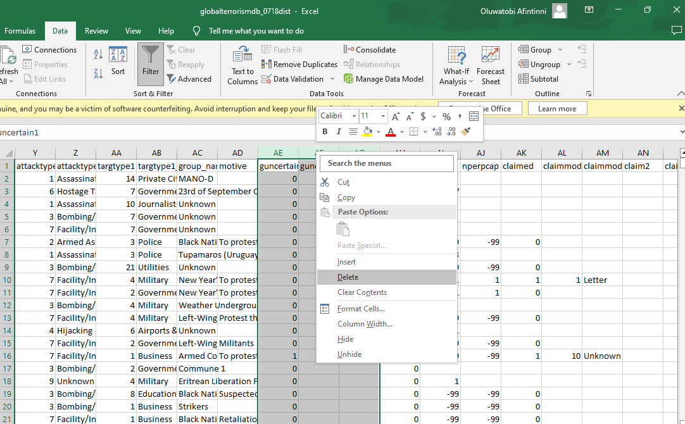

# Global-Terrorism-Analysis

## INTRODUCTION
The Global Terrorism Database is an event-level database containing more than 200,000 records of terrorist attacks that took place 
around the world since 1970. It is maintained by the National Consortium for the Study of Terrorism and Responses to Terrorism (START) at the University of Maryland. 
As part of my Data Science and Business Analytics internship at The Sparks Foundation Graduate Rotational Internship Program, I conducted an exploratory data analysis on the global terrorism database. The aim of the project was to analyze and gain insight into terrorist activities around the world.

## PROBLEM STATEMENT 
- Perform an Exploratory Data Analysis on the Global Terrorismm Dataset!
- As a Security/Defence Analyst, try to find out the hot zones of terrorism
- What are the security issues and insights you can derive from the EDA

## Tools Used
To transform, analyze and provide insights, the following tools were used
- Excel
- Power Query
- SQL
- Power BI

## Skills Demonstrated
- Data Manipulation
- Functions used to Query (Aggregate functions, Common Table Expressions, Correlations, Joins, Case Statements)
- Data Modelling in Power BI. I employed the star schema in building the Data model for the 5 datasets
- DAX
- Quick Measures
- Filters use in Power BI
- Slicers in Power Bi

## DATA CLEANING
The original dataset contained 139,872 rows and 135 columns and spans 1970-2014. The initial data cleaning process was carried out with Excel, and completed with Power Query  and Postgresql. The following steps breaks down the cleaning process I took in ensuring the dataset was clean, valid and ready for analysis.
- Dropped Irrelevant columns 
- 13,877 Duplicates records were removed
- Removed special characters
- Filled missing values with 'N/A' for string/text variables, and 0 for numeric variables

Cleaning_1              |           Cleaning_2
:------------------------:|:---------------------:
     |

## DATA NORMALIZATION
To reduce redundancy and enhance efficiency, I created 4 new tables, weapon, target, locations, and attack, using the primary key in each table to to link them to the original table, specified the relationship between the new tables and created an Entity Relationship Diagram (ERD) using QuickDBD.
 

## DATA ANALYSIS
For this phase, I created the Global Terrorism Database in postgreSQL, to accomodate the normalized dataset and imported the 5 tables into the GTD. After importing the tables, I further explored the datasets, to ask questions that were used to answr questions and  provide Insights. These questions were 
1. What are the hot zones of terrorism globally?
2. What are the Top 5 countries with terrorist attacks?
3. Which weapons were used the most during the attacks?
4. What is the trend for Number of terrorist attacks overtime?
5. What was the most common attack type in successful terrorist attacks?
6. Why is any particular attack type used the most? What is the success rate of these attack types?
7. Which Group of people are targeted the Most?
8. Which terrorist groups have contributed to the most attacks, and how much did they contribute 
9. What is the no of casualities based on each attack type? Which attk type has contribute most to casuality?
10. What is the trend of attacks over the years?

The solutions to these pressing questions can be found [here](https://github.com/TobyDavids/Global-Terrorism-Analysis/blob/main/PostgreSQL%20Analysis%20Solutions)

## DATA MODELLING
The model is a star shcema. There are 4 dimension tables and 1 fact table(event). The dimension tables were all joined to the fact table with a one-to-many relationship. 

## DATA VISUALIZATION
The dashboard contains 1 page of report. It was created to provide insights and answer the questions posed during the analysis phase. 
You can interact with the dashboard [here](https://app.powerbi.com/groups/me/reports/ea33dd0f-3794-43b9-b2a1-8ba4c08f093f/ReportSection?experience=power-bi). You can also get further insights [here](https://app.powerbi.com/groups/me/insights/7a7c0c64-648b-4062-a566-d0ed3ed479c2?insightsSource=Desktop&experience=power-bi)

## INSIGHTS
1. Between 1970 and 2014, there were 112,000 successful attacks, 283,000 confirmed deaths and 356,000 injured victims.
2. The hotzones for terrorism exist in Middle East & North Africa, Asia and South America. 
3. Over the years, the top 5 countries that have been plauged by these attacks are Iraq, Afghanistan, Pakistan, India, and Columbia
4. Bombings/Explosion and Armed Assaults noticeably contributed to over 50% of attacks. The use of bombs is clearly used as a means to cause mass casuality
5. Private citizens, Military and the Police are the most common targets by terrorists.  
6. Among the top 5 affected countries overtime, colombia has recorded a decrease in attacks from early 2000's
7. The Known/Identified groups (Taliban and Shinning Path) have contributed to the most attacks over the year. A major number of attacks contributed by "Unkown Groups" was excluded in my visualization. This was to only account for the known Groups. The Unknown groups could have been as aresult of inconclusive results from investigation, and we cannot clearly tell what group/s were they were.
8. In the past 5 decades, the number of recorded terrorist attacks has increased overtime, with 2014 recording the highest rate, while 1970 recording the least number.
9. Countries with the best capture success rate are Jordan, Serbia-Montenegro, and Chad. Overall, regions with the best capture rates are North America, Australasia & Oceania, and Western Europe. 

## CONCLUSIONS AN RECOMMENDATIONS
1. Given the global nature of terrorism, it is crucial for countries to enhance international cooperation in sharing intelligence, resources, and strategies to combat terrorism effectively. Collaborative efforts can help prevent successful attacks and minimize the impact of terrorism worldwide.
2. The Middle East & North Africa, Asia, and South America have been identified as hotzones for terrorism. Governments and international organizations should prioritize efforts and resources to address the root causes of terrorism in these regions. This can involve socio-economic development, political stability, and diplomatic initiatives to reduce the attractiveness of extremist ideologies.
3. Bombings and explosions have been a prevalent tactic used by terrorists. Governments should invest in robust counterterrorism strategies and technology to detect and prevent the use of explosives. Enhancing security measures in public spaces, critical infrastructure, transportation systems, and borders can help minimize the potential for mass casualties.
4. Private citizens, military personnel, and police are common targets for terrorist attacks. Governments should prioritize the security and safety of these groups through comprehensive security measures, intelligence sharing, training programs, and improved coordination between law enforcement agencies. Public awareness campaigns can also play a role in educating citizens about potential threats and encouraging reporting of suspicious activities.
5. It is highly concerning that firearms have contributed to the most deaths. This calls for more effective arms regulations to ensure citizens safety and prevent violent acts. 

