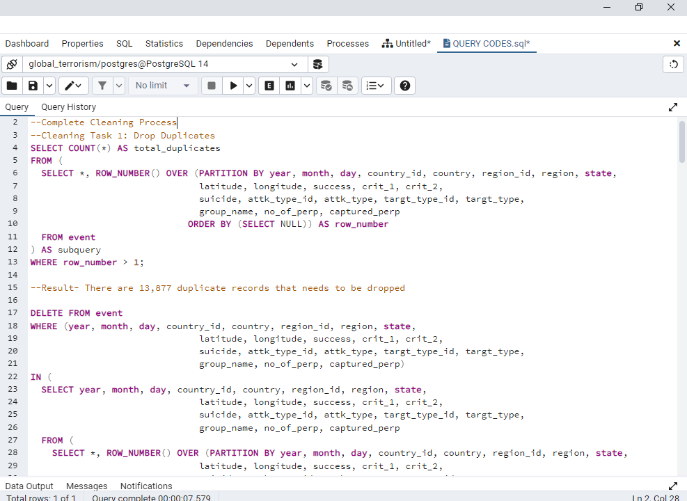

# Global-Terrorism-Analysis

## INTRODUCTION
The Global Terrorism Database is an event-level database containing more than 200,000 records of terrorist attacks that took place 
around the world since 1970. It is maintained by the National Consortium for the Study of Terrorism and Responses to Terrorism (START) at the University of Maryland. 
As part of my Data Science and Business Analytics internship at The Sparks Foundation Graduate Rotational Internship Program, I conducted an exploratory data analysis on the global terrorism database. The aim of the project was to analyze and gain insight into terrorist activities around the world.

## PROBLEM STATEMENT 
- Perform an Exploratory Data Analysis on the Global Terrorismm Dataset!
- As a Security/Defence Analyst, try to find out the hot zones of terrorism
- What are the security issues and insights you can derive from the EDA

## Tools Used
To transform, analyze and provide insights, the following tools were used
- Excel
- Power Query
- SQL
- Power BI

## Skills Demonstrated
- Data Manipulation
- Functions used to Query (Aggregate functions, Common Table Expressions, Correlations, Joins, Case Statements)
- Data Modelling in Power BI. I employed the star schema in building the Data model for the 5 datasets
- DAX
- Quick Measures
- Filters
- Slicers

## DATA CLEANING
The original dataset contained 139,872 rows and 135 columns. The initial data cleaning process was carried out with Excel, and completed with Power Query  and Postgresql. The following steps breaksdown the cleaning process I took in ensuring the dataset was clean, valid and ready for analysis.
- Dropped Irrelevant columns 
- 13,877 Duplicates records were removed
- Removed special characters
- Filled missing values with 'N/A' for string/text variables, and 0 for numeric variables

Cleaning_1              |           Cleaning_2
:------------------------:|:---------------------:
     |

## DATA NORMALIZATION
To reduce redundancy and enhance efficiency, I created 4 new tables, weapon, target, locations, and attack, using the primary key in each table to to link them to the original table, specifyed the relationship between the new tables and created an Entity Relationship Diagram (ERD) using QuickDBD.
 

## DATA ANALYSIS
For this phase, I created the Global Terrorism Database in postgreSQL, to accomodate the normalized dataset and imported the 5 tables into the GTD. After importing the tables, I further explored the datasets, to ask questions that were used to answr questions and  provide Insights. These questions were 
1. What are the hot zones of terrorism globally?
2. What are the Top 5 countries with terrorist attacks?
3. Which weapons were used the most during the attacks?
4. What is the trend for Number of terrorist attacks overtime?
5. What was the most common attack type in successful terrorist attacks?
6. Why is any particular attack type used the most? What is the success rate of these attack types?
7. Which Group of people are targeted the Most?
8. Which terrorist groups have contributed to the most attacks, and how much did they contribute 
9. What is the no of casualities based on each attack type? Which attk type has contribute most to casuality?
10. What is the trend of attacks over the years?

The solutions to these pressing questions can be found ()here

## DATA MODELLING
The model is a star shcema. There are 4 dimension tables and 1 fact table(event). The dimension tables were all joined to the fact table with a one-to-many relationship. 

